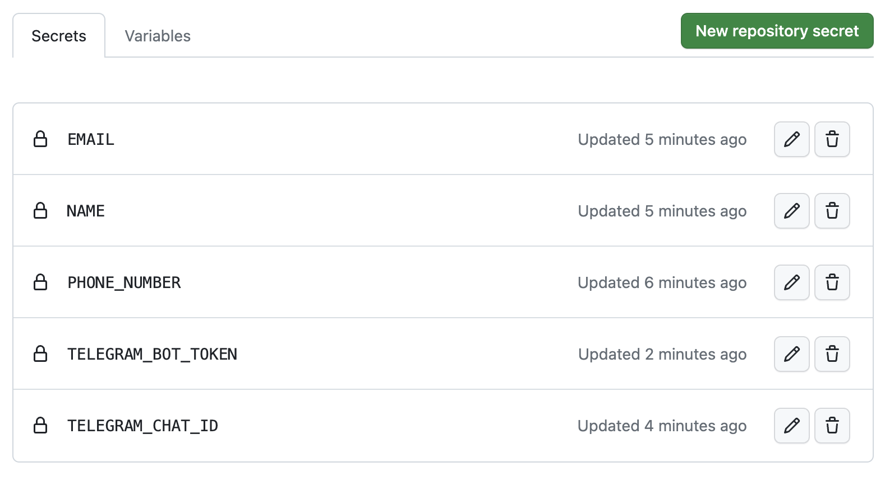

# ottawa-recreation-reservation

Ottawa recreation reservation script

## Intro

The script allows making sports reservations automatically.
It's powered by Python, schedules with GitHub Actions and sends notifications to Telegram.

Registration for drop-in events begins 2 days in advance at 6 PM so I use a cronjob to run the script periodically at this time.

File [`schedule.json`](schedule.json) contains a list of facilities (for Adult Volleyball in my case) in this format:

```json
{
  "name": "CARDELREC Recreation Complex Goulbourn",
  "home": "https://ottawa.ca/en/recreation-and-parks/recreation-facilities/facility-listing/cardelrec-recreation-complex-goulbourn",
  "link": "https://reservation.frontdesksuite.ca/rcfs/cardelrec/",
  "activity_button": "Volleyball - adult",
  "schedule": [
    {
      "day": 4,
      "starting_time": "8:30 PM",
      "follow": true
    }
  ]
}
```

## Prerequisites

*For getting a verification code from my email I use IMAP, if you are the owner of Gmail mailbox it won't work for you according to the [new Google's policy](https://support.google.com/accounts/answer/6010255)*

Before running the script, we have to prepare our environment variables with some confidential data.

There are two ways to do that: use a `.env` file or environment variables set manually (e.g. `export EMAIL=bla@blah.com`).
The first approach is good for running the script manually on the local machine and the second is to run on CI/CD.

The content of `.env` (or env vars in your CI/CD system) should have these variables, they are mandatory:

```ini
PHONE_NUMBER="234567890"
IMAP_EMAIL="my-email@gmail.com"
IMAP_PASSWORD="my-password"
IMAP_SERVER="mail.myserver.com"
NAME="John Doe"
TELEGRAM_BOT_TOKEN=12345:AABBCCDDEEFFGG
TELEGRAM_CHAT_ID=12345678
```

### How to get a Telegram token and chat ID

1. Go to [@BotFather](https://t.me/BotFather) and create `/newbot` (for example `ottawa_rec_reservation_bot`)
2. You will receive a token like `111111111:ABCDE`
3. Then go to [@MyTelegramID_bot](https://t.me/MyTelegramID_bot) and `/start` it
4. You will receive your Telegram ID like `123456789`

## Manual script usage

1. Ensure that you installed [`Python`](https://www.python.org/downloads/) on your machine
2. Go to the `src/` directory, and copy-paste file called [`.env-sample`](src/.env-sample) to `.env`
3. Edit the `src/.env` according to your credentials
4. Install required packages:

```bash
pip install -r requirements.txt
```

5. Run the script:

```bash
./src/reservation.py
...
```

## Script usage with GitHub Actions

Instead of running the script on a local machine, we can do that automatically with the Cron and GitHub Actions.

The idea is to run it periodically (for example every day at 5:59 PM) to be able to make a booking immediately.

1. Fork this repo
2. Go to `Settings - Secrets and variables - Actions` and set all needed secrets from the `.env-sample` file



3. You can see the result in the Actions tab on GitHub

*I've scheduled a script run at 5:59 pm due to the [high load period](https://docs.github.com/en/actions/using-workflows/events-that-trigger-workflows#schedule) on every hour in GitHub Actions*
