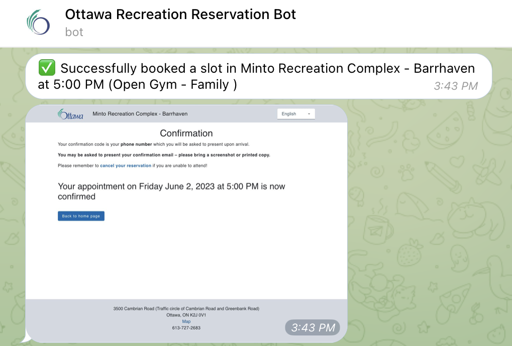

# Ottawa Recreation Reservation

[](https://github.com/Amet13/ottawa-recreation-reservation/actions/workflows/autoreservation.yaml)

Automate your Ottawa recreation reservations

## Motivation

The demand for recreational activities, such as Volleyball games, in Ottawa is high. To secure a slot for these activities, players need to book immediately when the registration opens, two days in advance at 6 PM.

To simplify this process and increase your chances of getting a reservation, I have created this script that:

1. Automates the registration for various drop-in events
2. Runs automatically using Cron with GitHub Actions, saving you time and effort
3. Parses verification codes from emails using IMAP. *Please note that this feature doesn't work with Gmail due to their policies ([learn more](https://support.google.com/accounts/answer/6010255))*
4. Sends the registration results to the Telegram account, keeping you updated



## Schedule configuration

The file [`schedule.json`](schedule.json) contains a list of facilities for Adult Volleyball (or any other activity). Each facility entry follows this format:

```json
{
  "name": "CARDELREC Recreation Complex Goulbourn",
  "home": "https://ottawa.ca/en/recreation-and-parks/recreation-facilities/facility-listing/cardelrec-recreation-complex-goulbourn",
  "link": "https://reservation.frontdesksuite.ca/rcfs/cardelrec/",
  "activity_button": "Volleyball - adult",
  "schedule": [
    {
      "day": 4,
      "starting_time": "8:30 PM",
      "follow": true
    }
  ]
}
```

- `name (str)`: The name of the facility
- `home (str)`: The homepage of the facility where you can find the schedule
- `link (str)`: The registration page for the facility
- `activity_button (str)`: The exact name of the button to be clicked for registration. Make sure to use the correct name (use the browser's inspector for the button element)
- `schedule[] (list)`: A list of schedules
- `day (int)`: The day of the week in ISO format (Monday - 1, Sunday - 7)
- `starting_time (str)`: The starting time for the activity
- `follow (bool)`: If set to `true`, the script will attempt to book this facility. Set it to `false` to skip

## Prerequisites

Before running the script, you need to set up some environment variables containing confidential data.

There are two ways to accomplish this: using a `.env` file or manually setting environment variables (e.g., `export EMAIL=bla@blah.com`).
The first approach is suitable for running the script manually on your local machine, while the second approach is intended for CI/CD environments.

The content of the `.env` file (or the environment variables in your CI/CD system) should include the following mandatory variables:

```ini
PHONE_NUMBER="234567890"
IMAP_EMAIL="my-email@gmail.com"
IMAP_PASSWORD="my-password"
IMAP_SERVER="mail.myserver.com"
NAME="John Doe"
TELEGRAM_BOT_TOKEN=12345:AABBCCDDEEFFGG
TELEGRAM_CHAT_ID=12345678
```

### How to Obtain a Telegram Token and Chat ID

1. Go to [@BotFather](https://t.me/BotFather) and create a new bot using the `/newbot` command (e.g., `ottawa_rec_reservation_bot`)
2. You will receive a token in the format `111111111:ABCDE`
3. Next, go to [@MyTelegramID_bot](https://t.me/MyTelegramID_bot) and start the bot using the `/start` command
4. You will receive your Telegram ID in the format `123456789`

## Manual Script Usage

1. Ensure that you have installed [Python](https://www.python.org/downloads/) on your machine
2. Make a copy of the file [`src/.env-sample`](src/.env-sample) named `src/.env`
3. Edit the contents of `src/.env` to match your credentials
4. Install the required packages by running the following command:

```bash
pip install -r requirements.txt
```

5. Run the script using the following command:

```bash
./src/main.py
```

## Script Usage with GitHub Actions

Instead of running the script on your local machine, you can automate it using GitHub Actions and Cron.

The script can be scheduled to run periodically, increasing your chances of getting a reservation immediately.

1. Fork this repository
2. Go to `Settings - Secrets and variables - Actions` in your forked repository and set all the required secrets from the `src/.env` file


3. You can monitor the script's execution and results in the Actions tab of your repository

*The script has been scheduled to run at 5:55 PM to avoid [high load periods](https://docs.github.com/en/actions/using-workflows/events-that-trigger-workflows#schedule) at the beginning of every hour in GitHub Actions*
